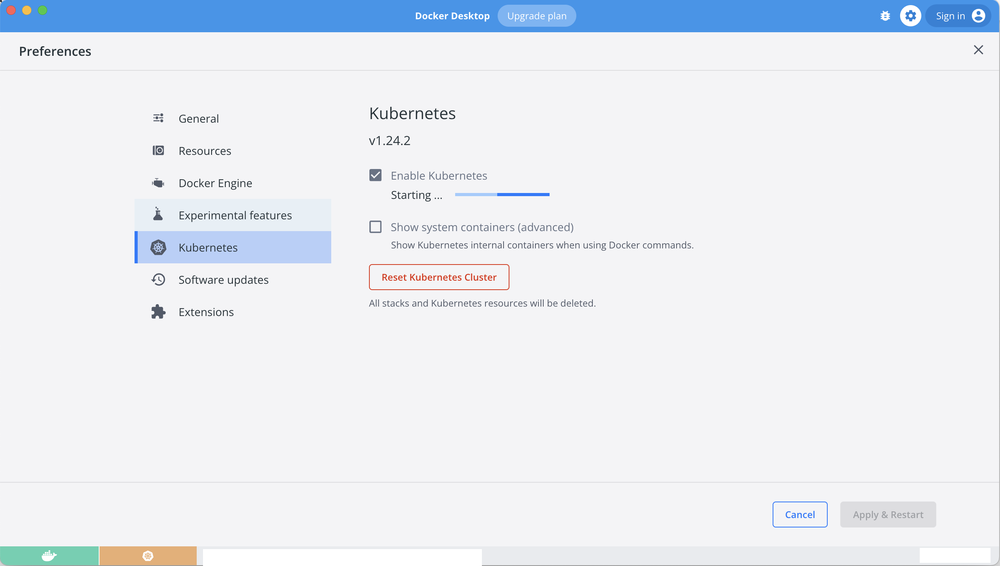

# micro-services-service-mesh
This repo contains micro services (golang, nodejs) to demonstrate service mesh usage to determine week parts of the distributed application.

# Prerequisites

- [Install Docker](https://docs.docker.com/get-docker/)
- [Enable Kubernetes with Docker Desktop](https://docs.docker.com/get-started/kube-deploy/)



- [Install Go](https://go.dev/doc/install)
- [Install Micro Framework and CLI](https://github.com/micro/micro#installation)
- [Pull Micro Framework Docker Image](https://hub.docker.com/r/micro/micro)

```bash
docker pull micro/micro
```

- [Install Protocol Buffer Compiler](https://grpc.io/docs/protoc-installation/)
- [Install linkerd](https://linkerd.io/2.12/getting-started/#)

```bash
# are you ready?
docker version
kubectl version
linkerd version
```

## Manually

```bash
# make micro cli executable to run it with docker
chmod +x ./bin/micro
# optionally update your PATH to include ./bin
PATH=$PATH:./bin/
```

# Start

Run server

```bash
# micro server
# docker run micro/micro:latest server
docker run -p 8080:8080 -p 8082:8082 -v $PWD:'/src' --name=micro micro/micro:latest server
```

Start web portal

```bash
# docker exec -it <CONTAINER-ID> ./micro web
docker exec -it micro ./micro web
# with cli
micro web
```

# Develop

Create new helloworld servce

```bash
micro new helloworld

# you should see instructions in console to
# compile the proto file helloworld.proto:

cd helloworld
make init
go mod vendor
make proto

# and start helloworld new service
micro run .
```

# Start Service Mesh

```bash
# install linkerd service mesh in kubernetes
linkerd install --crds | kubectl apply -f -

# !WARNING! If you get this message, try the following command
# there are nodes using the docker container runtime and proxy-init container must run as root user.
# try installing linkerd via --set proxyInit.runAsRoot=true
# error: no objects passed to apply

# linkerd install --set proxyInit.runAsRoot=true | kubectl apply -f -

linkerd check
```

- [ ] Follow [the `linkerd` Getting Started guide](https://linkerd.io/2.12/getting-started/#) to see first services in Service Mesh, including installed dashboard extension

[](https://linkerd.io/2.12/tasks/debugging-your-service/#)

# Inject Micro into Linkerd

# Debug Commands

```bash
kubectl get pods -A # list all k8s pods
```

# Links

- [Asim Aslam on Microservices, go-micro, and PaaS 3.0](https://soundcloud.com/infoq-channel/interview-asim-aslam)
- [Microservices in Golang](https://www.bookstack.cn/read/microservices-in-golang/1.md)
- [Getting Started - Welcome to Linkerd! 🎈](https://linkerd.io/2.12/getting-started/)
- [Debugging gRPC applications with request tracing](https://linkerd.io/2.12/tasks/debugging-your-service/)